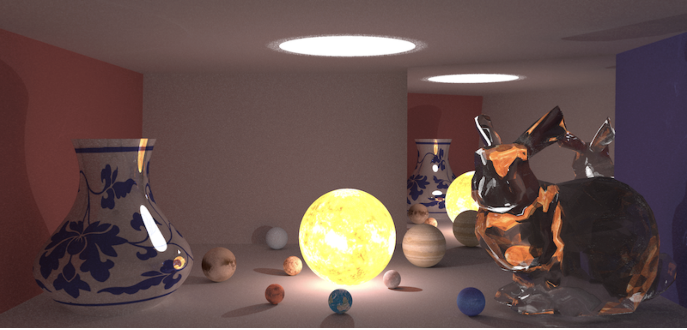

## Introduction
一个实现了路径追踪和SPPM随机渐近光子映射的渲染器。支持纹理映射、景深、重心差值、KDTree加速、包围盒加速等功能。

## Usage
在`./src/testcases`中定义了一些场景。
```
cd ./src
./run_all.sh
```

## 效果图


## Background
This is coursework for "Fundamentals of Computer Graphics", THU, Spring 2022.
